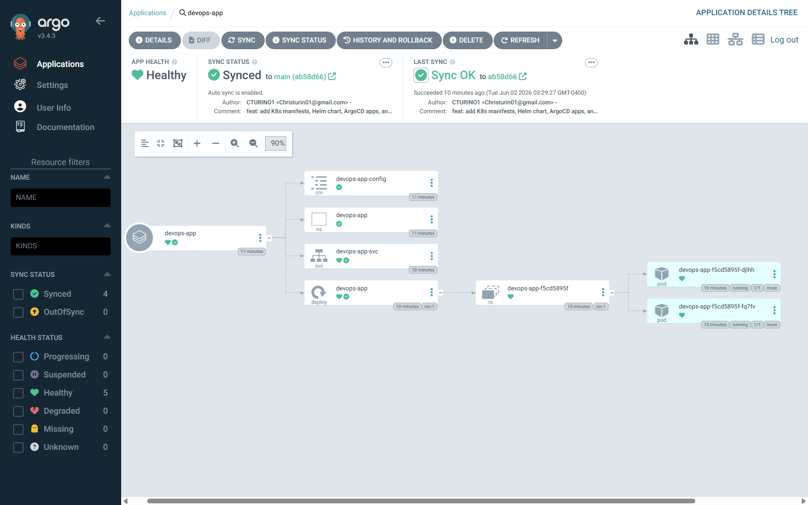

# devops-portfolio

A hands-on DevOps portfolio demonstrating real infrastructure skills across CI/CD pipelines, Infrastructure as Code, Kubernetes orchestration, GitOps deployment, monitoring, and incident management. All projects are fully functional and designed to reflect production-grade practices.

---

## Live GitOps Pipeline — ArgoCD + Kubernetes



This repo powers a **live GitOps pipeline** running on Kubernetes via ArgoCD:

- **App Health:** ✅ Healthy
- **Sync Status:** ✅ Synced to `main`
- **Resources:** ConfigMap, Namespace, Service, Deployment, 2 Pods
- **Pipeline:** `git push` → ArgoCD detects diff → auto-syncs to Kubernetes

ArgoCD watches this repo's `k8s/` folder. Any change pushed to `main` is automatically applied to the cluster — no manual `kubectl apply` required.

---

## Projects
 
### Project 1 — CI/CD Pipeline
**Directory:** `project-5-cicd/`  
**Stack:** GitHub Actions · Docker · GHCR · Kubernetes manifest validation
 
- Automated CI pipeline runs on every commit: builds Docker images, pushes to GitHub Container Registry (GHCR), and validates Kubernetes manifests with `kubeval`
- Deployment triggers on merge to `main` — zero manual steps from code push to running container
- Pipeline catches malformed YAML before it reaches the cluster
---
 
### Project 2 — Infrastructure Provisioning (Terraform)
**Directory:** `project-2-terraform/`  
**Stack:** Terraform · AWS (VPC, EC2, subnets, security groups) · Remote state
 
- Provisions VPC, subnets, security groups, and EC2 compute resources declaratively
- Modular design: each resource group is a separate module with its own `variables.tf` and `outputs.tf`
- State managed remotely — no local state files, safe for team use
- `terraform plan` output reviewed before every `apply`
---
 
### Project 3 — Kubernetes Orchestration
**Directory:** `project-3-kubernetes/`  
**Stack:** Kubernetes · Django REST API · MySQL · Docker · Helm
 
Manifests written from scratch — no generated boilerplate:
 
- **Deployment:** replica management, rolling update strategy, resource requests and limits
- **Service:** ClusterIP for internal routing, NodePort for external access
- **ConfigMap:** non-sensitive environment configuration
- **Secret:** base64-encoded database credentials
- **Namespace:** resource isolation
- **NetworkPolicy:** restricts pod-to-pod communication to defined rules
- **InitContainer:** waits for MySQL to be ready before the Django app starts — prevents crash loops on cold start
- **Readiness probe:** removes pod from service endpoints if the app is not ready to serve traffic
- **Liveness probe:** restarts the container if the app becomes unresponsive
**Failure scenario documented:**
 
Killed the MySQL pod while the Django app was running. The readiness probe failed within 10 seconds. Kubernetes removed the pod from the service endpoint and traffic stopped routing to it. MySQL restarted automatically. The Django pod returned to Ready state 23 seconds after the MySQL pod deletion. The gap in request metrics was visible in the Grafana dashboard. Full recovery was automatic — no manual intervention required.
 
---
 
### Project 4 — Monitoring & Observability
**Directory:** `project-4-monitoring/`  
**Stack:** Prometheus · Grafana · Helm · Alertmanager · Kubernetes
 
Full observability stack deployed via Helm:
 
- **Metrics collection:** Prometheus scrapes Kubernetes node, pod, and container metrics on a 15-second interval
- **Dashboards:** Grafana dashboards surface CPU usage, memory consumption, pod restart counts, and HTTP request rates
- **Alerting rules:** Prometheus alert fires when pod CPU exceeds 80% for more than 2 minutes
- **Log correlation:** pod logs reviewed alongside metrics to identify root cause during incidents
**PromQL queries used:**
 
```promql
# CPU usage by pod
rate(container_cpu_usage_seconds_total{namespace="default"}[5m])
 
# Memory usage by pod
container_memory_usage_bytes{namespace="default", container!="POD"}
 
# Pod restart count
increase(kube_pod_container_status_restarts_total[1h])
 
# HTTP request rate (Django app)
rate(django_http_requests_total[5m])
```
 
**Failure scenario documented:**
 
Deleted a running pod manually with `kubectl delete pod`. Grafana showed a spike in pod restarts and a gap in HTTP request metrics during the 8-second window before Kubernetes scheduled a replacement. The alert rule for pod restart count fired correctly. Documented the detection-to-recovery timeline in the incident runbook.
 
---
 
### Project 5 — AIOps
**Directory:** `project-5-cicd/`  
**Stack:** Python · log analysis · anomaly detection
 
- Automated log analysis pipeline flags anomalous patterns in application logs
- Uses statistical baseline comparison to surface outliers without manual threshold tuning
---
 
### Project 6 — Hybrid Cloud Incident Runbook
**Directory:** `project-6-hybrid-incident-runbook/`  
**Stack:** Terraform · AWS VPC · GCP VPC · GitHub Actions
 
Production-grade incident response documentation covering two cloud environments:
 
- **SEV-1/2/3 triage checklists:** step-by-step investigation paths for each severity level
- **Communication templates:** internal and external stakeholder updates at each incident stage
- **Recovery procedures:** rollback steps for deployment failures, database issues, and network partitions
- **Post-incident review template:** pre-filled structure for blameless postmortems
- **Deployment checklist:** pre, during, and post-deployment verification steps
Built after provisioning symmetric AWS and GCP VPC infrastructure with Terraform to understand cross-cloud failure modes.
 
---
 
## GitOps Architecture
 
```
Developer pushes to main
        │
        ▼
GitHub (source of truth)
        │
        ▼
Argo CD detects diff between Git state and cluster state
        │
        ▼
Argo CD syncs — applies manifests to Kubernetes
        │
        ▼
Kubernetes runs the updated workloads
selfHeal corrects any drift automatically
```
 
---
 
## Repo Structure
 
```
devops-portfolio/
├── k8s/                          # Raw Kubernetes manifests
│   ├── namespace.yaml
│   ├── deployment.yaml           # includes readiness/liveness probes, resource limits
│   ├── service.yaml
│   ├── configmap.yaml
│   ├── secret.yaml
│   └── networkpolicy.yaml
├── helm/                         # Helm chart (templated)
│   └── devops-app/
│       ├── Chart.yaml
│       ├── values.yaml
│       └── templates/
├── argocd/                       # Argo CD Application definitions
│   ├── application.yaml
│   └── app-of-apps.yaml
├── project-2-terraform/          # IaC — AWS + GCP
├── project-3-kubernetes/         # Django + MySQL manifests
├── project-4-monitoring/         # Prometheus + Grafana stack
├── project-5-cicd/               # CI/CD pipeline
├── project-6-hybrid-incident-runbook/
├── argocd-notes.md
├── deployment-checklist.md
└── gitops-workflow.md
```
 
---
 
## Stack
 
| Tool | Purpose |
|---|---|
| Kubernetes | Container orchestration |
| Argo CD | GitOps continuous delivery with selfHeal |
| Helm | Kubernetes package management |
| Terraform | Infrastructure as Code |
| Docker | Containerization |
| Prometheus | Metrics collection and alerting |
| Grafana | Dashboards and visualization |
| GitHub Actions | CI/CD automation and manifest validation |
| GHCR | Container image registry |
| AWS | Cloud infrastructure |
| GCP | Hybrid cloud infrastructure |
 
---
 
## How to Run Locally
 
### Prerequisites
- Docker Desktop running
- minikube installed
- kubectl installed
### Start the Cluster
 
```bash
minikube start --driver=docker --cpus=2 --memory=4096
```
 
### Install Argo CD
 
```bash
kubectl create namespace argocd
kubectl apply -n argocd -f https://raw.githubusercontent.com/argoproj/argo-cd/stable/manifests/install.yaml
kubectl get pods -n argocd -w
```
 
### Access Argo CD UI
 
```bash
kubectl port-forward svc/argocd-server -n argocd 8080:443
 
kubectl get secret argocd-initial-admin-secret \
  -n argocd \
  -o jsonpath="{.data.password}" | base64 -d && echo
```
 
Open `https://localhost:8080` — login with `admin` and the password above.
 
### Deploy the App
 
```bash
kubectl apply -f argocd/application.yaml
```
 
Argo CD syncs the app from this repo automatically.
 
---
 
## Troubleshooting
 
**Argo CD shows OutOfSync after push**
Wait 3 minutes for the default sync interval. Force a manual sync: `argocd app sync devops-app`
 
**MySQL pod not starting**
Check the initContainer logs: `kubectl logs <django-pod> -c init-wait-for-mysql`
The initContainer retries every 5 seconds until MySQL accepts connections.
 
**Grafana dashboards empty**
Verify Prometheus is scraping: open Prometheus UI at port 9090 and check `Status > Targets`
 
---
 

## Author

**Chris Turin**  
DevOps Engineer | FL  
[GitHub: CTURIN01](https://github.com/CTURIN01)
